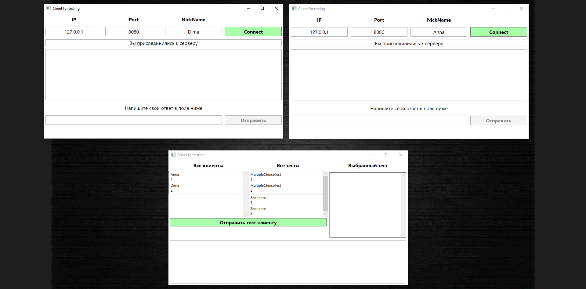

# Клиент-серверное приложение "Тестирование"
 В этом проекте реализовано клиент-серверное приложение "Тестирование" с 
 использованием TCP протокола. Для взаимодействия клиент-сервера используется 
 Socket. Приложение реализовано с помощью технологии WPF (и клиент и сервер) с 
 использованием паттерна MVVM.  

 На сервере есть несколько тестов (2 одного вида и 2 другого). Сервер отвечает за 
 отправку тестов клиентам, а клиенты получают тест, дают на него ответ и отправляют результат.  
 Все подключенные клиенты отображаются на сервере. При отправке теста клиенту, нужно выбрать 
 клиента в списке клиентов и тест, который сразу отобразится в поле рядом, чтобы можно было с ним 
 ознакомиться перед отправкой. Затем нужно нажать на кнопку отправки и выбранный тест отправится 
 выбранному клиенту. Также сервер записывает все результаты клиентов в текстовое поле внизу.  

 Сервер может поддерживать нескольких клиентов, имеет разные варианты тестов (на множественный выбор 
 и выбор последовательности). Все тесты хранятся на самом сервере.  

 При запуске программы сначала 1 раз запустите сервер (проект ServerWpf), а 
 затем можете запустить сколько угодно клиентов (проект ClientWpf).

 **Ниже представлены скриншоты программы:**

 Запуск 1 сервера и 2 клиентов
 
 Вводим имена у клиентов и нажимаем "Connect"
 
 На сервере выбираем клиента и тест для него (тест отображается справа от списка тестов)
 
 Нажимаем кнопку "Отправить тест клиенту" и тест оказывается у клиента
 
 Клиент ввёл ответ и нажал кнопку "Отправить". Результат фиксируется на сервере в текстовом поле
 
 Выбираем тест для другого клиента
 
 Отправляем ему тест. Клиент вводит в поле ответа свой ответ на тест
 
 Он нажимает кнопку отправки и новый результат снова фиксируется на сервере
 
 При отключении клиентов они автоматически удаляются из списка клиентов на сервере
 
