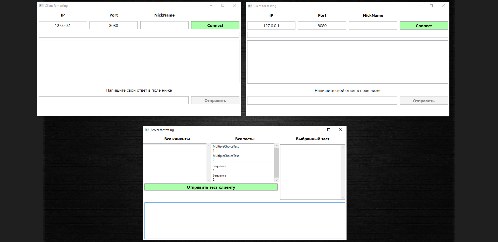

# Интерфейс для объектов на сцене
 В этом проекте создан интерфейс, через который можно управлять объектами на сцене.  
 Есть сцена, и на ней по умолчанию есть 5 объектов. Также при нажатии на клавишу 'E' создаются новые объекты (сферы разного цвета).  
 И для каждого объекта (для исходных 5 и для всех новых) в интерфейсе создаётся новая ячейка с кнопками управления для него.  
 Кнопки управления:
 1) кнопка в виде глазика позволяет скрыть или показать объект на сцене
 2) кнопка в виде чекбокса отмечает объект или снимает пометку
 3) кнопка выбора цвета, при нажатии на которую можно выбрать новый цвет объекта
 4) сама ячейка тоже является кнопкой, при нажатии на которую камера фокусируется именно на этом объекте

 На все помеченные объекты, у которых в чекбоксе стоит галочка, действуют кнопки вверху слева, позволяющие сменить прозрачность.  
 Также вверху справа есть кнопки из 1 и 2 пункта, но их эффект действует сразу на все объекты, а не только на один.  

 В проекте реализована камера. Вы можете вращать её вверх, влево, вниз и вправо, нажимая W,A,S,D соответственно. А также можете приближать 
 или отдалять, используя колёсико мыши.  
 По умолчанию камера направлена на всю сцену целиком, но её фокус можно изменить на отдельные объекты, выбирая их в списке интерфейса. Также 
 есть кнопка над списком, при нажатии на которую камера снова сфокусируется на всей сцене.

 Интерфейс управления объектами можно скрыть либо открыть, если нажать на 3 точки справа от него. При создании большого количества объектов, 
 элементы в списке на интерфейсе можно проматывать вверх или вниз.  
 
 Также в программе есть меню настроек, где можно отрегулировать чувствительность вращения и приближения/отдаления камеры.

 **Ниже на примерах показана работа программы:**  
 Старт программы
 
 Отдалили камеру и создали ещё несколько объектов нажатием клавиши E
 
 Скрыли несколько объектов с помощью глазика и изменили прозрачность 2 объектам, предварительно пометив их в чекбоксе
 
 Включили все объекты с помощью глазика сверху и изменили всем прозрачность. Также у 3-его объекта нажали на кнопку выбора цвета 
 (напротив него появилась палитра цветов)
 
 Изменили у 3-его объекта цвет на голубой, а у 5-го на зелёный
 
 Открыли меню паузы
 
 Открыли меню настроек
 
